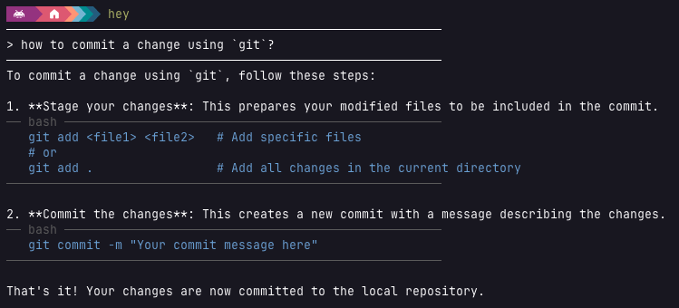

# hey

`hey` is a simple command-line AI assistant for your terminal - right there where you need it.

---



---

Install the latest release with a single command

```bash
curl -fsSL https://raw.githubusercontent.com/psugrg/hey/main/install.sh | sh
```

> [!NOTE]
> `hey` requires the [OpenRouter.ai](https://openrouter.ai) API key to function!

## Installation methods

### Install with curl

Install the latest release with a single command:

```bash
curl -fsSL https://raw.githubusercontent.com/psugrg/hey/main/install.sh | sh
```

This downloads the latest `linux_amd64` release and installs the `hey` binary to `~/.local/bin` (override with the `INSTALL_DIR` environment variable, and pin a specific version with `VERSION`, e.g. `VERSION=0.1.0 sh install.sh`).

> [!TIP]
> If `~/.local/bin` isn't already on your `$PATH`, the script will tell you how to add it.

### Download a prebuilt binary

Prebuilt binaries for Linux (amd64) are published on the [GitHub Releases](../../releases) page as `hey_x.x.x_linux_amd64.tar.gz`. Download and extract the archive, then copy the `hey` binary somewhere on your `PATH`, for example:

```bash
tar -xzf hey_x.x.x_linux_amd64.tar.gz
cp hey ~/.local/bin/hey
```

### Build from source

Build from source using Cargo:

```bash
git clone <repository-url>
cd hey/hey
cargo build --release
```

The compiled binary will be available at `target/release/hey`. Copy it somewhere on your `PATH` to use it as the `hey` command, for example:

```bash
cp target/release/hey ~/.local/bin/hey
```

### Make it accessible

Add the `~/.local/bin` directory to your `$PATH` variable.

```bash
export PATH="$HOME/.local/bin:$PATH"

```

> [!TIP]
> Add this export routine to your `.bashrc` or `.zshrc` file

## Configuration

`hey` requires an OpenRouter API key, provided via the `OPENROUTER_API_KEY` environment variable:

```bash
export OPENROUTER_API_KEY="your-api-key-here"
```

> [!TIP]
> Add this export routine to your `.bashrc` or `.zshrc` file

You can get an API key from [openrouter.ai](https://openrouter.ai).

## Usage

Run `hey` and type your question at the prompt:

```bash
hey
```

To ask a follow-up question that continues the previous answer, use the `-f` (or `--follow-up`) flag:

```bash
hey -f
```

> [!NOTE]
> Conversation history is kept separately per terminal, so using `-f` only continues the last conversation held in _that_ terminal — it won't pick up context from other terminals. Only the most recent conversation is remembered (no long-term history).

Use `-h` (or `--help`) to print usage information:

```bash
hey --help
```

## Requirements

- Rust toolchain (edition 2024)
- Internet connection
- An OpenRouter API key

## Versioning

This project follows [Semantic Versioning](https://semver.org/) (`MAJOR.MINOR.PATCH`):

- **MAJOR** — breaking changes to CLI behavior (e.g. invocation, output format, env vars)
- **MINOR** — new backward-compatible features (e.g. new flags, new providers)
- **PATCH** — bug fixes and other changes with no user-facing behavior change

While the version is `0.y.z` (pre-1.0), `y` is bumped for potentially breaking changes and `z` for fixes, per common SemVer convention for early-stage projects.

Run `hey --version` (or `hey -V`) to check the version of your installed binary. See [CHANGELOG.md](CHANGELOG.md) for release history and [RELEASING.md](RELEASING.md) for the release process.

## License

This project is licensed under the MIT License. See the `LICENSE` file for details.

## Contributing

See [AGENTS.md](AGENTS.md) for repo layout, build commands, and the release checklist.

## Backlog

1. Refactor the code by making smaller modules that are easier to maintain

   - [x] Extract the `config` module (API key, AI model, color scheme)
   - [x] Extract the `render` module (answer rendering)
   - [x] Extract the `client` module (OpenRouter API client and spinner logic)
   - [x] Extract the `prompt` module (question input)

2. Create Github actions to generate the release assets

   - [x] Automatically build and publish the `linux_amd64` release asset (`hey_x.x.x_linux_amd64.tar.gz`) on tag push

3. Installation script

   - [x] Add the `install.sh` script that will install the latest release version from the repository.

     The link to the repository `https://github.com/psugrg/hey`.
     The example path to the asset `https://github.com/psugrg/hey/releases/download/v0.1.0/hey_0.1.0_linux_amd64.tar.gz`.
     The example invocation `curl -fsSL https://github.com/psugrg/hey/install.sh | sh`.

   - [x] Extend the installation instructions to contain the step of installing the lates version with `curl`.
   - [x] The installation script should also check if the `OPENROUTER_API_KEY` is available and set. If not,
         the script should guide the user where to register it and how to add it to the environment variable (and to `.bashrc` and `.zshrc`).

4. Create `AGENTS.md` file

   - [x] Initialize the project in `opencode` with `/init` command to create the `AGENTS.md` file. More on that [here](https://opencode.ai/docs/rules/)
   - [x] Cleanup the `README.md` file to not to duplicate information from `AGENTS.md`
   - [x] Add rule to modularize the application. This means that the agent should not keep everything in one file but rather create software modules.
   - [x] Add rule to minimize commets in code. The code should be self-explanatory. Only the inrerfaces should be properly documented.

5. Add a new feature that allows to continue the discussion

   - [x] It should be possible to continue the discussion to add a follow-up questions.
         This should be possible by using the `-f` or `--follow-up` flag.
         It should be possible to continue the last conversation (only). No need to support the full history.

6. Support for `--help` option

   - [x] Implement the help functionality that will be triggered by the `--help` option.

7. Implement unit tests

   - [ ] Implement unit tests for the application.
   - [ ] Add a new entry to the `./AGENTS.md` file that asks to always write unit tests for the new functionality.
   - [ ] Create new GitHub action to run unit tests on each push.

8. Implement _buddies_, assistants that can be selected and individually configured

   - [ ] Modify the configuration module to accept the configuration file. File should be called `hey.toml` and be located in `.config/hey` directory.
         Things that are now hardcoded in the configuration module should stay hardcoded and used as defaults. The `hey.toml` configuration file should allow to overvrite them.
   - more to come...
